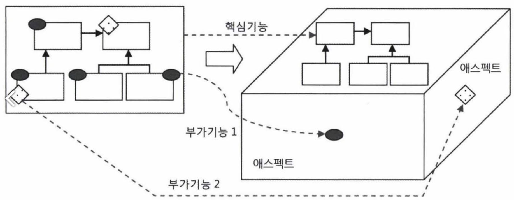
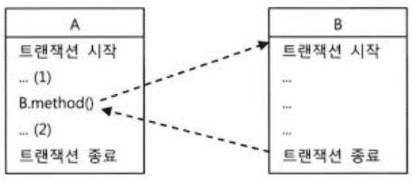

#6장. AOP
---

## 요약 및 결론
> 
    
## 책 내용
> AOP는 스프링 3대 기반기술 중 하나이다.(IoC/DI, 서비스 추상화)
>
> OOP를 대체하려는 것 처럼 보이는 AOP의 등장배경과 스프링이 이것을 도입한 이유, 장점을 이해해야 한다.
> ```
> 1. 등장배경 : 여러 핵심기능들에 중복되는 부가기능들이 있었음
> 2. 이유 : 부가기능들을 깔끔하게 뽑아내고 싶었음
> 3. 장점 : 중복 없이 독립적인 모듈로 구분해냈음. 핵심기능은 순수하게 그 기능을 담은 코드로만 존재하고 독립적으로 살펴볼 수 있도록 구분된 면에 존재하게 됨
> ```
> 
> 어드바이스 : 스프링에서 타깃 객체에 적용할 부가기능을 담은 객체
>
> 포인트컷 : 메서드 선정 알고리즘을 담은 객체
>
> 서비스 계층을 트랜잭션이 시작되고 종료되는 경계로 정했다면, 테스트와 같은 특별한 이유가 아니고는 다른 계층이나 모듈에서 DAO에 직접 접근하는 것은 차단해야 한다.
>
> 핵심 : 504쪽 AOP: 애스펙트 지향 프로그래밍
>
> Aspect : 그 자체로 애플리케이션의 핵심 기능을 담고 있지는 않지만, 애플리케이션을 구성하는 중요한 한 가지 요소이고 핵심기능에 부가되어 의미를 갖는 특별한 모듈을 가리킨다.
>
> 


### 1. 트랜잭션 코드의 분리
- 코드를 정리해본다 :
    1. 한 메서드가 하나의 책임만 갖도록 : UserService.upgradeLevelsInternal()
    2. 한 클래스가 하나의 책임만 갖도록 : UserService에서 트랜잭션 경계설정 코드
1. 메서드 분리
    - upgradeLevels()에서 트랜잭션 경계설정 코드와 비즈니스 로직 코드를 분리한다.
    - <details markdown="1">
      <summary>코드 접기/펼치기</summary>
      <pre>
      // 트랜잭션 경계설정 코드만 남은 메서드
      public void upgradeLevels() {
        TransactionStatus status = transactionManager.getTransaction(new DefaultTransactionDefinition());
        try {
          upgradeLevelsInternal();
          transactionManager.commit(status);
        } catch (Exception e) {
          transactionManager.rollback(status);
          throw e;
        }
      }      
      // upgradeLevels에서 비즈니스로직만 분리
      private void upgradeLevelsInternal() {
        List<User> userList = userDao.getAll();
        userList.forEach(user -> {
          if (canUpgradeLevel(user)) {
            upgradeLevel(user);
          }
        });
      }
      </pre>
      </details>
2. DI를 이용한 클래스의 분리
    - 트랜잭션을 담당하는 코드는 UserService에 있을 필요가 없으니 클래스 밖으로 뽑아낸다.
    - UserService에 인터페이스를 도입하고 구현클래스를 2개 둔다(UserServiceImpl, UserServiceTx)
    - UserServiceTx는 트랜잭션 경계설정에 대한 책임만 갖게된다.
    - UserServiceTx는 비즈니스 로직을 전혀 갖지 않고 다른 UserService 구현 오브젝트에 위임만 한다.
    - 트랜잭션이 적용된 UserServiceTx
    - <details markdown="1">
      <summary>코드 접기/펼치기</summary>
      <pre>
      @RequiredArgsConstructor
      public class UserServiceTx implements UserService {      
        private final UserService userService;
        private final PlatformTransactionManager transactionManager;  
        ...
        public void upgradeLevels() {
          TransactionStatus status = transactionManager.getTransaction(new DefaultTransactionDefinition());
          try {
            userService.upgradeLevels();
            transactionManager.commit(status);
          } catch (Exception e) {
            transactionManager.rollback(status);
            throw e;
          }
        }
        ...
      }
      </pre>
      </details>
    - 트랜잭션 경계설정 코드 분리의 장점
        1. UserServiceImpl은 트랜잭션 내용을 신경쓰지 않아도 된다.
        2. 비즈니스 로직에 대한 테스트를 손쉽게 만들어낼 수 있다.(다음절에서 확인)
    - @Transactional이 더 편리해 보인다.

### 2. 고립된 단위 테스트
- 가장 편하고 좋은 테스트 방법은 가능한 한 작은 단위로 쪼개서 테스트하는 것이다.
    - 테스트가 실패했을 때 원인을 찾기 쉽다.
1. 복잡한 의존관계 속의 테스트
    - UserService는 꽤 복잡하다
    - UserService 뒤에 존재하는 훨씬 더 많은 객체, 환경, 서비스, 서버, 네트워크까지 테스트 하는 셈이다.
2. 테스트 대상 객체 고립시키기
    - 그래서
        - 외부 요소들에 영향을 받지 않도록 고립시킬 필요가 있다.
    - 장점
        1. 다른 요소를 배제한 UserService의 기능만을 테스트할 수 있다.
        2. 다른 요소들에 필요한 자원들을 소모하지 않으므로 수행 성능이 좋다.(속도 향상)
    - 테스트를 위한 UserServiceImpl 고립
        - MockUserDao, MockMailSender 사용하면 됨
    - 고립된 단위테스트 활용
        - upgradeLevels()에 적용
        - UserDao 목 객체
            - UserServiceTest전용이므로 스태틱 내부 클래스로 선언
        - <details markdown="1">
          <summary>코드 접기/펼치기</summary>
          <pre>
          @Test
          public void upgradeLevels() throws Exception {
            // 고립된 테스트이므로 대상 객체를 직접 생성한다.
            UserServiceImpl userService = new UserServiceImpl();
            // 목 객체를 set해준다.
            MockUserDao mockUserDao = new MockUserDao(this.userList);
            userService.setUserDao(mockUserDao);
            MockMailSender mockMailSender = new MockMailSender();
            userService.setMailSender(mockMailSender);
            // 목 객체를 가진 UserService의 메서드를 수행한다.
            userService.upgradeLevels();
            // UserService 결과가 담긴 목 객체의 값들을 확인한다.
            List<User> updated = mockUserDao.getUpdated();
            assertThat(updated.size()).isEqualTo(3);
            checkUserAndLevel(updated.get(0), userList.get(1).getId(), Level.SILVER);
            checkUserAndLevel(updated.get(1), userList.get(3).getId(), Level.GOLD);
            checkUserAndLevel(updated.get(2), userList.get(4).getId(), Level.GOLD);
            List<String> requests = mockMailSender.getRequests();
            assertThat(requests.size()).isEqualTo(3);
            assertThat(requests.get(0)).isEqualTo(userList.get(1).getEmail());
            assertThat(requests.get(1)).isEqualTo(userList.get(3).getEmail());
            assertThat(requests.get(2)).isEqualTo(userList.get(4).getEmail());
          }
          </pre>
          </details>
3. 단위 테스트와 통합 테스트
    - 이 책에서 단위 테스트 : 의존 오브젝트나 외부 리소스를 사용하지 않도록 고립시킨 테스트
    - 이 책에서 통합 테스트 : 외부의 DB, 파일 등의 리소스가 참여하는 테스트
    - 선택 가이드라인
        1. 항상 단위테스트 먼저 고려
        2. 외부리소스를 사용해야만 하는 경우에는 통합 테스트
        3. 단위 테스트를 만들기가 너무 복잡하면 처음부터 통합테스트를 고려해본다.
4. 목 프레임워크
    - Mockito 프레임워크
        - 특징 : 목 클래스를 준비할 필요 없음
        - 오... 좋은데
        - 생성자 의존성 주입으로 바꾸면 더 좋겠다.
        - 좋은데 앞으로 안쓴단다. 왜안쓰지;;
        - <details markdown="1">
          <summary>코드 접기/펼치기</summary>
          <pre>
          @Test
          public void upgradeLevelsWithMockito() {
            UserServiceImpl userService = new UserServiceImpl();
            UserDao mockUserDao = mock(UserDao.class);
            when(mockUserDao.getAll()).thenReturn(this.userList);
            userService.setUserDao(mockUserDao);
            MailSender mockMailSender = mock(MailSender.class);
            userService.setMailSender(mockMailSender);
            userService.upgradeLevels();
            // 목 객체가 제공하는 검증 기능 활용
            // 어떤 메서드가 몇 번 호출됐는지, 파라미터는 무엇인지 확인할 수 있다.
            verify(mockUserDao, times(3)).update(any(User.class));
            verify(mockUserDao).update(userList.get(1));
            assertThat(userList.get(1).getLevel()).isEqualTo(Level.SILVER);
            verify(mockUserDao).update(userList.get(3));
            assertThat(userList.get(3).getLevel()).isEqualTo(Level.GOLD);
            verify(mockUserDao).update(userList.get(4));
            assertThat(userList.get(4).getLevel()).isEqualTo(Level.GOLD);
            // 파라미터를 정밀하게 검사하기 위해 캡처
            ArgumentCaptor<SimpleMailMessage> mailMessageArgs = ArgumentCaptor.forClass(SimpleMailMessage.class);
            verify(mockMailSender, times(3)).send(mailMessageArgs.capture());
            List<SimpleMailMessage> mailMessages = mailMessageArgs.getAllValues();
            assertThat(mailMessages.get(0).getTo()[0]).isEqualTo(userList.get(1).getEmail());
            assertThat(mailMessages.get(1).getTo()[0]).isEqualTo(userList.get(3).getEmail());
            assertThat(mailMessages.get(2).getTo()[0]).isEqualTo(userList.get(4).getEmail());
          }
          </pre>
          </details>

### 3. 다이내믹 프록시와 팩토리 빈
1. 프록시와 프록시 패턴, 데코레이터 패턴
    - 프록시
        - 클라이언트는 인터페이스만 보고 사용하기 때문에 핵심기능을 갖는 클래스(타깃)를 사용할 것으로 기대하지만 실제적으로는 부가기능(프록시)을 통해 핵심기능을 사용하는 구성
        - 클라이언트 -> 프록시 -> 타깃 
        - 프록시 : 마치 자신이 실제 대상인 것처럼 위장해서 클라이언트의 요청을 대리인처럼 대신 받아줌
        - 타깃 또는 실체 : 프록시를 통해 최종적으로 요청을 위임받아 처리하는 실제 객체
        - 프록시의 목적
            1. 클라이언트가 타깃에 접근하는 방법을 제어하기 위함
            2. 타깃에 부가적인 기능을 부여해주기 위함
    - 데코레이터 패턴
        - 타깃에 부가적인 기능을 런타임 시점에 동적으로 부여해주기 위해 프록시를 사용하는 패턴
        - 동적인 이유 : 컴파일 시점에는 프록시와 타깃의 관계가 정해져있지 않기 때문
        - 데코레이터인 이유 : 여러 겹의 포장지와 장식처럼 실제 내용물에는 변함 없지만 부가적인 효과를 부여하기 때문
        - 대표적인 예 : InputStream(내용물) - FileInputStream(부가기능 + 내용물)
        - 예제에서 UserService와 UserServiceTx도 데코레이터 패턴
    - 프록시 패턴
        - 일반적으로 사용하는 프록시와 디자인 패턴 프록시 패턴에서의 프록시는 구분이 필요하다.
            - 전자 : 클라이언트와 사용 대상 사이에 대리 역할을 맡은 객체를 두는 방법을 총칭
            - 후자 : 프록시를 사용하는 방법 중 타깃에 대한 접근 방법을 제어하려는 목적을 가진 경우
        - 프록시 패턴에서 프록시는
            - 타깃의 기능을 확장하거나 추가하지 않는다.
            - 클라이언트가 타깃에 접근하는 방식을 변경해준다.
            - ```
              타깃 객체를 생성하기가 복잡하거나 당장 필요하지 않은 경우에는 꼭 필요한 시점까지 객체를 생성하지 않는 편이 좋다.
              그런데 타깃 객체에 대한 레퍼런스가 미리 필요할 수 있다.
              이럴 때 프록시 패턴을 적용한다.
              실제 타깃 객체를 만드는 대신 프록시를 넘겨준다.
              프록시의 메서드를 통해 타깃을 사용하려고 시도하면?
              그때 프록시가 타깃 객체를 생성하고 요청을 위임하는 식이다.
              ```
    - 앞으로는...
        - 타깃과 동일한 인터페이스를 구현하고
        - 클라이언트와 타깃 사이에 존재하면서
        - 기능의 부가 또는 접근 제어를 담당하는 객체
        - 를 모두 프록시라고 부르겠다.
2. 다이내믹 프록시
    - 프록시는 기존 코드에 영향을 주지 않으면서 기능을 확장하거나 접근 방법을 제어하는 유용한 방법이다.
        - 그러나 번거롭기 때문에 손이 안간다.
        - 프록시도 목 프레임워크 처럼 편리하게 사용할 수 있는 방법이 있을까?
    - 프록시의 구성과 프록시 작성의 문제점
        - 프록시의 구성
            1. 타깃과 같은 메서드를 구현하고 있다가 메서드가 호출되면 타깃 객체로 위임한다.
            2. 지정된 요청에 대해서는 부가기능을 수행할 수 있다.
        - UserServiceTx에서 프록시의 구성
        - <details markdown="1">
          <summary>코드 접기/펼치기</summary>
          <pre>   
          public class UserServiceTx implements UserService {          
            @Autowired private PlatformTransactionManager transactionManager;          
            @Autowired private UserServiceImpl userService;          
            // 타깃 객체로 위임
            public void add(User user) { userService.add(user); }          
            public void upgradeLevels() {
              // 부가기능 수행 ~
              TransactionStatus status = transactionManager.getTransaction(new DefaultTransactionDefinition());
              try {                
                userService.upgradeLevels(); // 타깃 객체로 위임
                transactionManager.commit(status);
              } catch (Exception e) {
                transactionManager.rollback(status);
                throw e;
              }
              // ~ 부가기능 수행
            }
          }
          </pre>
          </details>
        - 프록시 작성의 문제점
            1. 타깃의 인터페이스를 구현하고 위임하는 코드를 작성하기 번거롭다. 메서드가 추가되거나 변경될 때 마다 해줘야된다.
            2. 부가기능 코드 중복이 몹시 심해진다.
    - 리플렉션
        - JDK의 다이내믹 프록시는 리플렉션 기능을 이용해서 프록시를 만들어 준다.
        - <details markdown="1">
          <summary>코드 접기/펼치기</summary>
          <pre>
          @Test
          public void invokeMethod() throws Exception {
            String name = "Spring";
            // length
            int nameLength = name.length();
            Method lengthMethod = String.class.getMethod("length");
            assertThat(lengthMethod.invoke(name)).isEqualTo(nameLength);
            // charAt
            int index = 0;
            char charAt = name.charAt(index);
            Method charAtMethod = String.class.getMethod("charAt", int.class);
            assertThat(charAtMethod.invoke(name, index)).isEqualTo(charAt);
          }          
          </pre>
          </details>
    - 프록시 클래스
        - 다이내믹 프록시를 이용한 프록시를 만들어본다.
        - HelloProxyTest.simpleProxy()는 프록시 적용의 일반적인 문제점 두가지를 모두 갖는다.
    - 다이내믹 프록시 적용(UppercaseHandler, HelloProxyTest.dynamicProxy())
        - HelloUppercaseProxy를 다이내믹 프록시를 이용해 만들어본다.
        - Hello 인터페이스에 메서드가 아무리 많아도 InvocationHandler에서 invoke메서드 하나로 처리한다.
        - 충분히 재사용할 수 있다.
        - 메서드를 선별해서 사용할 수도 있다.
3. 다이내믹 프록시를 이용한 트랜잭션 부가기능
    - UserServiceTx를 다이내믹 프록시 방식으로 변경
    - 변경하는 이유?
        1. 서비스 인터페이스의 메서드를 모두 구현해야 함
        2. 트랜잭션이 필요한 메서드 마다 트랜잭션 처리코드가 중복
    - 트랜잭션 InvocationHandler
        - 트랜잭션 부가기능을 갖는 핸들러
        - <details markdown="1">
          <summary>코드 접기/펼치기</summary>
          <pre>
          public class TransactionHandler implements InvocationHandler {
            // 부가기능을 제공할 타깃 객체. 어떤 타입의 객체든 적용할 수 있다.
            @Setter private Object target;
            // 트랜잭션을 제공하기 위한 트랜잭션 매니저
            @Autowired private PlatformTransactionManager transactionManager;
            // 트랜잭션을 적용할 메서드 이름 패턴
            @Setter private String pattern;
            public Object invoke(Object proxy, Method method, Object[] args) throws Throwable {
              if (method.getName().startsWith(pattern)) {
                return invokeInTransaction(method, args);
              } else {
                return method.invoke(target, args);
              }
            }
            private Object invokeInTransaction(Method method, Object[] args) throws Throwable {
              TransactionStatus status = this.transactionManager.getTransaction(new DefaultTransactionDefinition());
              try {
                Object ret = method.invoke(target, args);
                this.transactionManager.commit(status);
                return ret;
              } catch (InvocationTargetException e) {
                this.transactionManager.rollback(status);
                throw e.getTargetException();
              }
            }
          }
          </pre>          
          </details>
    - TransactionHandler와 다이내믹 프록시를 이용하는 테스트
        - UserServiceTest에 적용
        - <details markdown="1">
          <summary>코드 접기/펼치기</summary>
          <pre>
          @Test
          public void upgradeAllOrNothing() {
            TestUserService testUserService = new TestUserService(userList.get(3).getId());
            testUserService.setUserDao(this.userDao);
            testUserService.setMailSender(mailSender);
            TransactionHandler txHandler = new TransactionHandler();
            txHandler.setTarget(testUserService);
            txHandler.setTransactionManager(transactionManager);
            txHandler.setPattern("upgradeLevels");
            UserService txUserService = (UserService)Proxy.newProxyInstance(
                    getClass().getClassLoader(),
                    new Class[] { UserService.class },
                    txHandler
            );
            userDao.deleteAll();
            userList.forEach(user -> userDao.add(user));
            try {
              txUserService.upgradeLevels();
              fail("TestUserServiceException expected");
            } catch (TestUserServiceException e) {
            }
            checkLevelUpgraded(userList.get(1), false);
          }
          </pre>
          </details>
4. 다이내믹 프록시를 위한 팩토리 빈
    - 이제 TransactionHandler와 다이내믹 프록시를 스프링의 DI를 통해 사용할 수 있도록 만들 차례다.
    - 그런데 일반적인 빈으로 등록할 수 없는게 문제
        - 스프링 빈은 클래스 이름과 프로퍼티로 정의되는데?
        - 스프링은 지정된 클래스 이름을 가지고 리플렉션을 이용해서 해달 클래스의 객체를 만들어요
        - 다이내믹 프록시 객체는 이런 식으로 프록시 객체가 생성되지 않는다는 점이다.
        - 다이내믹 프록시는 Proxy클래스의 newProxyInstance()라는 스태틱 메서드를 통해서만 만들 수 있다.
    - 팩토리 빈
        - 스프링을 대신해서 객체의 생성로직을 담당하도록 만들어진 특별한 빈
        - 팩토리 빈을 등록하는 가장 간단한 방법은 스프링의 FactoryBean인터페이스를 구현하는 방법
        - 생성자를 제공하지 않는 Message클래스를 팩토리 빈으로 등록하는 예제
        - <details markdown="1">
          <summary>코드 접기/펼치기</summary>
          <pre>
          // 참고 : https://www.baeldung.com/spring-factorybean
          @RunWith(SpringJUnit4ClassRunner.class)
          @ContextConfiguration(classes = FactoryBeanConfig.class)
          public class MessageFactoryBeanTest {          
            @Autowired
            private ApplicationContext context;          
            @Qualifier("message")
            @Autowired
            private Message message;          
            @Resource(name = "&message")
            private MessageFactoryBean messageFactoryBean;          
            @Test
            public void getMessageFromFactoryBean() throws Exception {
              Object messageFromContext = context.getBean("message");
              assertThat(messageFromContext).isInstanceOf(Message.class);
              assertThat(((Message) messageFromContext).getText()).isEqualTo("Factory Bean");
              assertThat((message).getText()).isEqualTo("Factory Bean");
              Message messageFromFactoryBean = messageFactoryBean.getObject();
              assertThat(messageFromFactoryBean.getText()).isEqualTo("Factory Bean");
            }
          }
          </pre>
          </details>
    - 다이내믹 프록시를 만들어주는 팩토리 빈
        - 팩토리 빈을 사용하면 스프링의 빈으로 만들어 줄 수 있군(팩토리 빈의 getObject 메서드)
        - <details markdown="1">
          <summary>FactoryBean코드 접기/펼치기</summary>
          <pre>
          @Setter
          public class TxProxyFactoryBean implements FactoryBean&lt;Object&gt; {
            private Object target;
            private PlatformTransactionManager transactionManager;
            private String pattern;
            private Class&lt;?&gt; serviceInterface;          
            // FactoryBean 구현 메서드
            @Override
            public Object getObject() throws Exception {
              TransactionHandler txHandler = new TransactionHandler();
              txHandler.setTarget(target);
              txHandler.setTransactionManager(transactionManager);
              txHandler.setPattern(pattern);
              return Proxy.newProxyInstance(getClass().getClassLoader(),
                      new Class[]{serviceInterface},
                      txHandler);
            }
            public Class&lt;?&gt; getObjectType() {
              return serviceInterface;
            }
              public boolean isSingleton () {
                // 싱글톤 빈이 아니라는 뜻이 아님
                // getObject가 매 번 같은 객체를 리턴하지 않는다는 의미
                return false;
            }
          }
          </pre>
          </details>          
        - <details markdown="1">
          <summary>Config 코드 접기/펼치기</summary>
          <pre>
          @Configuration
          public class FactoryBeanConfig {          
            @Autowired private UserServiceImpl userServiceImpl;
            @Autowired private PlatformTransactionManager transactionManager;
            @Bean(name = "txProxy")
            public TxProxyFactoryBean txProxyFactoryBean() {
              TxProxyFactoryBean factoryBean = new TxProxyFactoryBean();
              factoryBean.setTarget(userServiceImpl);
              factoryBean.setTransactionManager(transactionManager);
              factoryBean.setPattern("upgradeLevels");
              factoryBean.setServiceInterface(UserService.class);
              return factoryBean;
            }          
          }
          </pre>
        - </details>
          <details markdown="1">
          <summary>테스트 코드 접기/펼치기</summary>
          <pre>
          @RunWith(SpringRunner.class)
          @SpringBootTest
          @Slf4j
          class UserServiceTest {
            @Autowired private TxProxyFactoryBean txProxy;
            @Test
            public void upgradeAllOrNothing() throws Exception {
              TestUserService testUserService = new TestUserService(userList.get(3).getId());
              testUserService.setUserDao(this.userDao);
              testUserService.setMailSender(mailSender);
              txProxy.setTarget(testUserService);
              UserService txProxyUserService = (UserService)txProxy.getObject();
          
              userDao.deleteAll();
              userList.forEach(user -> userDao.add(user));
              try {
                txProxyUserService.upgradeLevels();
                fail("TestUserServiceException expected");
              } catch (TestUserServiceException e) {
              }
              checkLevelUpgraded(userList.get(1), false);
            }
            static class TestUserService extends UserServiceImpl {
              private String id;
              public TestUserService(String id) {
                this.id = id;
              }
              protected void upgradeLevel(User user) {
                if (user.getId().equals(this.id)) {
                  throw new TestUserServiceException();
                }
                super.upgradeLevel(user);
              }
            }
          }
          </pre>
          </details>
5. 프록시 팩토리 빈 방식의 장점과 한계
    - 프록시 팩토리 빈의 재사용
        - TransactionHandler를 이용하는 TxProxyFactoryBean은 코드 수정 없이 다양한 클래스에 적용할 수 있다.
    - 프록시 팩토리 빈 방식의 장점
        - 데코레이터 패턴이 적용된 프록시를 사용할 때 발생하는 문제 두 가지를 해결할 수 있다.
            1. 프록시 대상 클래스를 일일이 만들어야 하는 번거로움
            2. 부가기능 코드 중복
    - 프록시 팩토리 빈의 한계
        1. 여러 클래스에 공통적인 부가기능을 제공하려면 중복이 발생한다.
            - 한 클래스 안에 있는 여러 메서드에 부가기능을 제공하는건 가능하다.
            - 비슷한 설정이 계속 반복돼서 나타나게 될 것
        2. TransactionHandler 객체가 프록시 팩토리 빈 개수만큼 만들어질 것이다.
            - 타깃 객체를 프로퍼티로 갖고있다(UserServiceImpl)
            - 그래서 타깃 객체가 여러개라면 그 개수만큼 빈을 선언하고 그만큼 객체가 생성 된다.
            - 싱글톤 빈으로 만드는게 좋겠지?
- 여기까지 요약
```
AOP 냄새가 나기 시작했다.
1 트랜잭션 코드의 분리 : AOP들어가기위한 준비
2 고립된 단위테스트
 - 1에서 분리한 내용의 장점을 테스트코드에 적용
 - 장점 : 코드 분리를 통해 비즈니스 로직에 대한 테스트를 더 쉽게 만들 수 있음(비즈니스 로직 UserService 코드와 부가기능 트랜잭션 경계설정 코드 분리)  
 - mockito는 내용 설명하다 생각나서 끼워넣은거 같은데 참 좋아보였다. 안쓴다니 아쉽다.
3. 다이내믹 프록시와 프록시 패턴
 - 프록시 패턴을 적용해서 부가기능을 추가했다.
  - 기존 코드에 영향 없이 필요한 기능을 추가했다.
 - 프록시를 팩토리 빈으로 등록했다.
  - 필요한 기능이 중복되는 경우 중복을 어느정도 막을 수 있다.
  - 하지만 타깃 객체가 여러개가 되는 경우 설정 중복을 피할 수 없다.
  - AOP 냄새가 난다.
AOP? 중복되는 기능을 코드 중복 없이 동작하게 하는 방법?
```
### 4. 스프링의 프록시 팩토리 빈
1. ProxyFactoryBean
    - 스프링은 일관된 방법으로 프록시를 만들 수 있게 도와주는 추상레이어를 제공한다.
    - ProxyFactoryBean : 프록시를 생성해서 빈 객체로 등록하게 해주는 팩토리 빈이다.
    - ProxyFactoryBean을 이용한 다이내믹 프록시 테스트(6-41)
    - ProxyFactoryBean에 타깃 객체를 설정하고 부가기능을 추가한 다음 ProxyFactoryBean에서 설정한 객체를 빼오는식
    - <details markdown="1">
      <summary>테스트 코드 접기/펼치기</summary>
      <pre>
      public class HelloProxyTest {
        @Test
        public void proxyFactoryBean() {
          ProxyFactoryBean pfBean = new ProxyFactoryBean();
          pfBean.setTarget(new HelloTarget()); //타깃 설정
          pfBean.addAdvice(new UppercaseAdvice()); //부가기능 추가
          Hello proxiedHello = (Hello) pfBean.getObject(); //FacotryBean이므로 생성된 프록시를 가져온다.      
          assertThat(proxiedHello.sayHello("Toby")).isEqualTo("HELLO TOBY");
          assertThat(proxiedHello.sayHi("Toby")).isEqualTo("HI TOBY");
          assertThat(proxiedHello.sayThankYou("Toby")).isEqualTo("THANKYOU TOBY");
        }      
        static class UppercaseAdvice implements MethodInterceptor {
          public Object invoke(MethodInvocation invocation) throws Throwable {
            String ret = (String)invocation.proceed(); //타깃을 알고 있기에 타깃 오브젝트를 전달할 필요가 없다.
            return ret.toUpperCase(); //부가기능 적용
          }
        }      
      }
      </pre>
      </details>
    - 어드바이저 : 어드바이스(부가기능)와 포인트컷(메서드 선정 알고리즘)을 묶은 객체
    - 어드바이스 : 타깃이 필요 없는 순수한 부가기능
        - UppercaseAdvice에는 타깃 객체가 등장하지 않는다.(setTarget 했기 때문)
        - addAdvice : 여러 개의 MethodInterceptor(부가기능)를 추가할 수 있다.
        - 어드바이스 : 타깃 객체에 종속되지 않는 순수한 부가기능을 담은 객체
    - 포인트컷 : 부가기능 적용 대상 메서드 선정 방법
        - TxProxyFactoryBean에서는 대상 메서드를 setPattern으로 설정
        - MethodInterceptor 객체는 타깃 정보를 갖고 있지 않으므로 메서드 패턴으로 대상 메서드를 선택하는 방식은 사용할 수 없다.
        - 프록시에 부가기능 적용 대상 메서드를 선택하는 기능을 넣으면 된다.
        - 어드바이스가 템플릿이 되고 MethodInvocation 객체가 콜백이 되는 식
        - 스프링이 제공하는 NameMatchMethodPointcut과 UppercaseAdvice 활용 테스트 코드
        - <details markdown="1">
          <summary>테스트 코드 접기/펼치기</summary>
          <pre>
          @Test
          public void pointcutAdvisor() {
            ProxyFactoryBean pfBean = new ProxyFactoryBean();
            pfBean.setTarget(new HelloTarget());
            // 메서드 이름을 비교해서 대상을 선정하는 알고리즘을 제공하는 포인트컷 객체
            NameMatchMethodPointcut pointcut = new NameMatchMethodPointcut();
            pointcut.setMappedName("sayH*");
            // 포인트컷과 어드바이스를 advisor로 묶어서 한 번에 추가
            // 묶는 이유? 어떤 어드바이스에 대해 어떤 포인트컷을 사용할 지 명확하게 구분하기 위해
            // 여러 개의 어드바이스와 포인트컷이 추가될 수 있기 때문
            pfBean.addAdvisor(new DefaultPointcutAdvisor(pointcut, new UppercaseAdvice()));
            Hello proxiedHello = (Hello) pfBean.getObject();
            assertThat(proxiedHello.sayHello("Toby")).isEqualTo("HELLO TOBY");
            assertThat(proxiedHello.sayHi("Toby")).isEqualTo("HI TOBY");
            assertThat(proxiedHello.sayThankYou("Toby")).isEqualTo("ThankYou Toby");
          }
          </pre>
          </details>
2. ProxyFactoryBean 적용
    - JDK 다이내믹 프록시의 구조를 그대로 이용해서 만들었던 TxProxyFactoryBean을 스프링이 제공하는 ProxyFactoryBean을 이용하도록 수정
    - 어드바이스와 포인트컷의 재사용
        - ProxyFactoryBean은 스프링의 DI, 템플릿/콜백 패턴, 서비스 추상화 등의 기법이 모두 적용된 것이다.
        - 아래 예제코드에서는 UserService만 적용했지만 그 외에 다른 클래스도 이름 패턴만 지정해서 ProxyFactoryBean에 등록해주면 된다.
    - TransactionAdvice
        - 예제코드
        - <details markdown="1">
          <summary>테스트 코드 접기/펼치기</summary>
          <pre>
          @Setter
          public class TransactionAdvice implements MethodInterceptor {
            PlatformTransactionManager transactionManager;
            // 타깃을 호출하는 기능을 가진 콜백 객체를 프록시로부터 받는다.
            // 덕분에 어드바이스는 특정 타깃에 의존하지 않고 재사용할 수 있다.
            public Object invoke(MethodInvocation methodInvocation) throws Throwable {
              TransactionStatus status = this.transactionManager.getTransaction(new DefaultTransactionDefinition());
              try {
                // 콜백을 호출해서 타깃의 메서드를 실행
                // 타깃 메서드 호출 전후로 필요한 부가기능을 넣을 수 있다.
                // 경우에 따라 타깃이 아예 호출되지 않게끔 하거나 재시도를 위한 반복적 호출도 가능하다.
                Object ret = methodInvocation.proceed();
                this.transactionManager.commit(status);
                return ret;
                // JDK 다이내픽 프록시가 제공하는 Method와 달리
                // 스프링의 MethodInvocation을 통한 타깃 호출은 예외가 포장되지 않고 타깃에서 보낸 그대로 전달된다.
              } catch (RuntimeException e) {
                this.transactionManager.rollback(status);
                throw e;
              }
            }
          }
          </pre>
          </details>
    - 스프링 XML 설정파일
        - 코드는 손볼곳이 없고 설정만 해주면 된다.
        - 어드바이스를 등록한다.
            - 설정파일(Java Config)
            - <details markdown="1">
              <summary>테스트 코드 접기/펼치기</summary>
              <pre>
              @Configuration
              @RequiredArgsConstructor
              public class AopConfig {
                private final PlatformTransactionManager transactionManager;
                private final UserService userService;
                @Bean
                public TransactionAdvice transactionAdvice() {
                  return new TransactionAdvice(transactionManager);
                }
                @Bean
                public NameMatchMethodPointcut transactionPointcut() {
                  NameMatchMethodPointcut pointcut = new NameMatchMethodPointcut();
                  pointcut.setMappedName("upgrade*");
                  return pointcut;
                }
                @Bean
                public DefaultPointcutAdvisor transactionAdvisor() {
                  DefaultPointcutAdvisor pointcutAdvisor = new DefaultPointcutAdvisor();
                  pointcutAdvisor.setAdvice(transactionAdvice());
                  pointcutAdvisor.setPointcut(transactionPointcut());
                  return pointcutAdvisor;
                }
                @Bean
                public ProxyFactoryBean userServiceProxyFactoryBean() {
                  ProxyFactoryBean factoryBean = new ProxyFactoryBean();
                  factoryBean.setTarget(userService);
                  factoryBean.setInterceptorNames("transactionAdvisor");
                  return factoryBean;
                }
              }
              </pre>
              </details>
            - 테스트코드
            - <details markdown="1">
              <summary>테스트 코드 접기/펼치기</summary>
              <pre>
              @Test
              public void upgradeAllOrNothing() {
                TestUserService testUserService = new TestUserService(userList.get(3).getId());
                testUserService.setUserDao(this.userDao);
                testUserService.setMailSender(mailSender);
                ProxyFactoryBean proxyFactoryBean = context.getBean("&userServiceProxyFactoryBean", ProxyFactoryBean.class);
                proxyFactoryBean.setTarget(testUserService);
                UserService txUserService = (UserService) proxyFactoryBean.getObject();
                try {
                  txUserService.upgradeLevels();
                  fail("TestUserServiceException expected");
                } catch (TestUserServiceException e) { }
                checkLevelUpgraded(userList.get(1), false);
              }
              </pre>
              </details>

### 5. 스프링 AOP
- 지금까지 : 반복적으로 등장하는 트랜잭션 코드를 깔끔하고 효과적으로 분리
    - 투명한 부가기능이다 : 기존 설계와 코드에는 영향을 주지 않음(있는 듯 없는 듯)
1. 자동 프록시 생성
    - 아직 남은 문제 : 설정정보를 계속 추가해주는 번거로움
    - 중복 문제의 접근 방법
        - 지금까지 살펴본 방법에는 한 번에 여러 빈에 프록시를 적용할 만한 방법은 없었다.
    - 빈 후처리기를 이용한 자동 프록시 생성기
        - 빈 후처리기 : 빈 객체로 만든 후에 그 빈 객체를 다시 가공할 수 있게 해준다.
        - 빈 후처리기를 빈으로 등록하면 사용할 수 있다.
        - 빈 객체 일부를 프록시로 포장하고 프록시를 빈으로 대신 등록할 수도 있다.
        - 빈 후처리기의 동작
        - ```
          1. 빈 후처리기가 등록돼있으면 스프링은 빈 객체를 만들 때 마다 후처리기에게 빈을 보낸다.
          2. 빈 후처리기는 등록된 어드바이저의 포인트컷을 이용해 전달받은 빈이 프록시 적용 대상인지 확인한다.
          3. 적용 대상이면? 내장된 프록시 생성기에게 현재 빈에 대한 프록시를 만들게 하고 어드바이저를 연결한다.
          4. 프록시를 만들었으면? 전달받은 빈 객체 대신 만든 프록시 객체를 돌려준다.
          5. 스프링은 돌려받은 프록시 객체를 빈으로 등록하고 사용한다.
          ```
    - 확장된 포인트컷
        - 포인트컷은 클래스 필터와 메서드 매처 두 가지를 돌려주는 메서드를 갖고있다.
        - 모든 빈에 대해 프록시 적용 대상인지 판단해야 하는 상황에서는 클래스와 메서드 선정 알고리즘을 모두 갖는 포인트컷이 필요하다.
    - 포인트컷 테스트
        - 확장 포인트컷 학습 테스트 코드
        - <details markdown="1">
          <summary>테스트 코드 접기/펼치기</summary>
          <pre>
          @Test
          @Description("확장 포인트컷 테스트 480p")
          public void classNamePointcutAdvisor() {
            // 포인트컷 준비
            NameMatchMethodPointcut pointcut = new NameMatchMethodPointcut() {
              public ClassFilter getClassFilter() {
                // 클래스 이름이 HelloT로 시작하는 것만 선택
                return aClass -> aClass.getSimpleName().startsWith("HelloT");
              }
            };
            // sayH로 시작하는 메서드만 선택
            pointcut.setMappedName("sayH*");
            checkAdviced(new HelloTarget(), pointcut, true);
            checkAdviced(new HelloWorld(), pointcut, false);
            checkAdviced(new HelloToby(), pointcut, true);
          }          
          class HelloWorld extends HelloTarget { }
          class HelloToby extends HelloTarget { }          
          private void checkAdviced(Object target, Pointcut pointcut, boolean adviced) {
            ProxyFactoryBean pfBean = new ProxyFactoryBean();
            pfBean.setTarget(target);
            pfBean.addAdvisor(new DefaultPointcutAdvisor(pointcut, new UppercaseAdvice()));
            Hello proxiedHello = (Hello) pfBean.getObject();
            if (adviced) {
              assertThat(proxiedHello.sayHello("Toby")).isEqualTo("HELLO TOBY");
              assertThat(proxiedHello.sayHi("Toby")).isEqualTo("HI TOBY");
              assertThat(proxiedHello.sayThankYou("Toby")).isEqualTo("ThankYou Toby");
            } else {
              assertThat(proxiedHello.sayHello("Toby")).isEqualTo("Hello Toby");
              assertThat(proxiedHello.sayHi("Toby")).isEqualTo("Hi Toby");
              assertThat(proxiedHello.sayThankYou("Toby")).isEqualTo("ThankYou Toby");
            }
          }
          </pre>
          </details>
2. DefaultAdvisorAutoProxyCreator의 적용
    - 클래스 필터를 적용한 포인트컷 작성
        - 주어진 이름 패턴을 가지고 클래스를 찾아내는 ClassFilter를 추가하도록 만들 것이다.
        - <details markdown="1">
          <summary>코드 접기/펼치기</summary>
          <pre>
          public class NameMatchClassMethodPointcut extends NameMatchMethodPointcut {
            public void setMappedClassName(String mappedClassName) {
              // 매개변수로 받은 클래스 이름을 이용한 필터
              this.setClassFilter(new SimpleClassFilter(mappedClassName));
            }
            static class SimpleClassFilter implements ClassFilter {
              private final String mappedName;
              public SimpleClassFilter(String mappedName) {
                this.mappedName = mappedName;
              }
              @Override
              public boolean matches(Class<?> clazz) {
                if (mappedName.startsWith("Test") || clazz.getSimpleName().startsWith("Test")) {
                  System.out.println("!!!!!!!!!!!");
                }
                if (mappedName.startsWith("User") || clazz.getSimpleName().startsWith("User")) {
                  System.out.println("!!!!!!!!!!!");
                }
                System.out.println(String.format("mappedName : %s, classSimpleName : %s", mappedName, clazz.getSimpleName()));
                return PatternMatchUtils.simpleMatch(mappedName, clazz.getSimpleName());
              }
            }
          }
          </pre>
          </details>
    - 어드바이저를 이용하는 자동 프록시 생성기 등록, 포인트컷 등록
        - <details markdown="1">
          <summary>코드 접기/펼치기</summary>
          <pre>
          @Bean
          public NameMatchClassMethodPointcut transactionPointcut() {
            NameMatchClassMethodPointcut pointcut = new NameMatchClassMethodPointcut();
            // 클래스 이름 패턴
            pointcut.setMappedClassName("*ServiceImpl");
            // 메서드 이름 패턴
            pointcut.setMappedName("upgrade*");
            return pointcut;
          }          
          @Bean
          public DefaultPointcutAdvisor transactionAdvisor() {
            DefaultPointcutAdvisor pointcutAdvisor = new DefaultPointcutAdvisor();
            pointcutAdvisor.setAdvice(transactionAdvice());
            pointcutAdvisor.setPointcut(transactionPointcut());
            return pointcutAdvisor;
          }          
          @Bean
          public ProxyFactoryBean userServiceProxyFactoryBean() {
            transactionAdvisor();
            ProxyFactoryBean factoryBean = new ProxyFactoryBean();
            factoryBean.setTarget(userService);
            factoryBean.setInterceptorNames("transactionAdvisor");
            return factoryBean;
          }
          </pre>
          </details>
    - 테스트코드
        - <details markdown="1">
          <summary>코드 접기/펼치기</summary>
          <pre>
          @Test
          public void upgradeAllOrNothing() {
            userDao.deleteAll();
            userDao.addAll(userList);
            testUserServiceImpl.setMailSender(mailSender);
            try {
              testUserServiceImpl.upgradeLevels();
              fail("TestUserServiceException expected");
            } catch (TestUserServiceException e) { }
            checkLevelUpgraded(userList.get(1), false);
          }
          </pre>
          </details>
    - 자동생성 프록시 확인
        - 포인트컷 클래스 이름 필터를 *NotServiceImpl로 바꿔서 확인
        - 자동생성된 프록시 확인(testUserService가 프록시로 변경된 객체인지)
3. 포인트컷 표현식을 이용한 포인트컷
    - 더 편리한 포인트컷 작성 방법
    - 포인트컷 표현식
        - 정규식 같은 일종의 표현식 언어를 사용해서 포인트컷을 작성하는 방시
        - AspectJExpressionPointcut 클래스 사용
    - 포인트컷 표현식 문법
        - ```
          [] : 옵션(생략가능)
          | : or조건
          execution([접근제한자 패턴] 타입패턴1 [타입패턴2.]이름패턴 (타입패턴3 | "..", ...) [throws 예외 패턴])
          접근제한자 : public, private 등
          타입패턴1 : 리턴 값의 타입 패턴
          타입패턴2 : 패키지와 클래스 이름에 대한 패턴. 사용할 때는 '.'으로 연결
          이름패턴 : 메서드 이름 패턴
          타입패턴3 : 파라미터의 타입을 순서대로 넣을 수 있다. 와일드 카드 사용 가능
          예외 패턴 : 예외 이름 패턴
          ```
        - 포인트컷 표현식 테스트
        - <details markdown="1">
          <summary>테스트 코드 접기/펼치기</summary>
          <pre>
          @Test
          public void methodSignaturePointcut() throws SecurityException, NoSuchMethodException {
            // aspectjweaver 디펜던시 필요
            AspectJExpressionPointcut pointcut = new AspectJExpressionPointcut();
            pointcut.setExpression("execution(public int toby.common.learningtest.Target.minus(int,int)) ");
            // Target.minus() : 성공
            assertThat(pointcut.getClassFilter().matches(Target.class) &&
                    pointcut.getMethodMatcher().matches(Target.class.getMethod("minus", int.class, int.class), null)).isTrue();
            // Target.plus() : 메서드 매처에서 실패
            assertThat(pointcut.getClassFilter().matches(Target.class) &&
                pointcut.getMethodMatcher().matches(Target.class.getMethod("plus", int.class, int.class), null)).isFalse();
            // Bean.method() : 클래스 매처에서 실패
            assertThat(pointcut.getClassFilter().matches(Bean.class) &&
                pointcut.getMethodMatcher().matches(Target.class.getMethod("method"), null)).isFalse();
          }
          </pre>
          </details>
    - 포인트컷 표현식 테스트
        - ```
          // 두 개의 정수형 파라미터를 갖는 minus라는 이름의 모든 메서드를 선정하는 포인트컷
          execution(int minus(int, int))
          // 리턴타입 상관없는 포인트컷
          execution(* minus(int, int))
          // 파라미터 개수와 타입을 무시하는 포인트컷
          execution(* minus(..))
          // 모든 메서드 다 허용
          execution(* *(..))
          ```
        - <details markdown="1">
          <summary>테스트 코드 접기/펼치기</summary>
          <pre>
          @Test
          public void pointcut() throws NoSuchMethodException {
            targetClassPointcutMatches("execution(* *(..))", true, true, true, true, true, true);
            targetClassPointcutMatches("execution(* *(int, int))", false, false, true, true, false, false);
            targetClassPointcutMatches("execution(* *..*get.*(..))", true, true, true, true, true, false);
            targetClassPointcutMatches("execution(void *(..))", true, true, false, false, true, true);
          }
          // 타깃 클래스 메서드에 대해 포인트컷 선정여부를 검사하는 헬퍼 메서드
          public void targetClassPointcutMatches(String expression, boolean... expected) throws NoSuchMethodException {
            pointcutMatches(expression, expected[0], Target.class, "hello");
            pointcutMatches(expression, expected[1], Target.class, "hello", String.class);
            pointcutMatches(expression, expected[2], Target.class, "plus", int.class, int.class);
            pointcutMatches(expression, expected[3], Target.class, "minus", int.class, int.class);
            pointcutMatches(expression, expected[4], Target.class, "method");
            pointcutMatches(expression, expected[5], Bean.class, "method");
          }
          // 포인트컷과 메서드를 비교해주는 테스트 헬퍼 메서드
          private void pointcutMatches(String expression, Boolean expected, Class<?> clazz, String methodName, Class<?>... args) throws NoSuchMethodException {
            AspectJExpressionPointcut pointcut = new AspectJExpressionPointcut();
            pointcut.setExpression(expression);
            assertThat(pointcut.getClassFilter().matches(clazz) &&
                pointcut.getMethodMatcher().matches(clazz.getMethod(methodName, args), null)).isEqualTo(expected);
          }
          </pre>
          </details>
    - 포인트컷 표현식을 이용하는 포인트컷 적용
        - ```
          @Bean
          public AspectJExpressionPointcut transactionPointcut() {
            AspectJExpressionPointcut pointcut = new AspectJExpressionPointcut();
            pointcut.setExpression("execution(* *..*ServiceImpl.upgrade*(..))");
            return pointcut;
          }
          ```
        - 코드와 설정이 단순해진다.
        - 문자열로 된 표현식이기 때문에 런타임 시점까지 문법의 검증이나 기능 확인이 불가능하다.
    - 타입 패턴과 클래스 이름 패턴
        - TestUserServiceImpl 클래스 이름을 TestUserService로 바꾸면 테스트는 실패하는가?
        - 슈퍼클래스가 UserServiceImpl이고 인터페이스는 UserService이기 때문에 ServiceImpl로 끝나는 타입 패턴의 조건을 충족한다.
        - 타입 패턴의 조건을 충족하기 때문에 테스트는 실패하지 않는다.
- 여기까지 요약
```
AOP 냄새가 나기 시작했다.
1 트랜잭션 코드의 분리 : AOP들어가기위한 준비
2 고립된 단위테스트
 - 1에서 분리한 내용의 장점을 테스트코드에 적용
 - 장점 : 코드 분리를 통해 비즈니스 로직에 대한 테스트를 더 쉽게 만들 수 있음(비즈니스 로직 UserService 코드와 부가기능 트랜잭션 경계설정 코드 분리)  
 - mockito는 내용 설명하다 생각나서 끼워넣은거 같은데 참 좋아보였다. 안쓴다니 아쉽다.
3. 다이내믹 프록시와 프록시 패턴
 - 프록시 패턴을 적용해서 부가기능을 추가했다.
  - 기존 코드에 영향 없이 필요한 기능을 추가했다.
 - 프록시를 팩토리 빈으로 등록했다.
  - 필요한 기능이 중복되는 경우 중복을 어느정도 막을 수 있다.
  - 하지만 타깃 객체가 여러개가 되는 경우 설정 중복을 피할 수 없다.
  - AOP 냄새가 난다.
AOP? 중복되는 기능을 코드 중복 없이 동작하게 하는 방법?
4. 스프링의 프록시 팩토리 빈
 - 프록시 팩토리 빈에 타깃객체를 설정하고 부가기능을 추가한 다음 설정한 객체를 하나씩 빼오는 식
 - 어드바이스와 포인트컷을 묶어서 어드바이저를 만들고 팩토리 빈에 등록한다.
 - 괜찮긴 한데 설정정보를 계속 추가해주는 번거로움이 있다.
5. 스프링 AOP
 - 빈 후처리기를 사용해서 포인트컷에 맞는 타깃에 부가기능을 적용하는 방법 사용(NameMatchClassMethodPointcut)
 - 더 편한 포인트컷 표현식 활용(aspectjweaver)
 - 결국 빈이 생길 때 마다 포인트컷에 맞는 대상에 트랜잭션 기능이 추가됐고 부가기능이 추가된 빈은 프록시로 존재하게됨
```
4. AOP란 무엇인가?
    - UserService에 트랜잭션을 적용해온 과정을 정리해보면
        1. 트랜잭션 서비스 추상화
            - 트랜잭션 처리에 대한 구체적인 구현 방법을 자유롭게 바꿀 수 있도록 추상화 기법 적용
            - 서버환경에서 종속되지 않음
        2. 프록시와 데코레이터 패턴
            - 비즈니스 로직 코드에 부가기능(트랜잭션) 코드가 보이지 않게됐음
        3. 다이내믹 프록시와 프록시 팩토리 빈
            - 부가기능 부여 코드 중복되는 문제 해결(JDK 다이내믹 프록시)
            - 포인트 컷과 부가기능을 분리해서 여러 프록시에서 공유하도록 설정(프록시 팩토리 빈)
        4. 자동 프록시 생성 방법과 포인트컷
            - 트랜잭션 대상 빈 마다 프록시 팩토리빈을 설정해주는 문제 해결(빈 후처리기)
            - 포인트컷 표현식 활용(aspectjweaver)
        5. 부가기능의 모듈화
            - TransactionAdvice라는 이름으로 모듈화
    - AOP : Aspect Oriented Programmin
        - 
            - 왼쪽 : 2차원적인 평면 구조에 중복된 부가기능들 분포
            - 오른쪽 : 3차원 구조에서 부가기능을 다른 면에 존재하도록 설계
        - AOP
            - 부가적인 기능을 분리해서 Aspect라는 독특한 모듈로 만들어서 설계하고 개발하는 방법
            - OOP를 돕는 보조적인 기술
            - 관점 지향 프로그래밍 : 애플리케잇녀을 특정한 관점을 기준으로 바라볼 수 있게 해준다는 의미
        - Aspect 
            - 그 자체로 애플리케이션의 핵심 기능을 담고 있지는 않지만, 애플리케이션을 구성하는 중요한 요소이다.
            - 핵심기능에 부가되어 의미를 갖는 특별한 모듈이다.
            - 부가기능이 정의된 어드바이스와 어드바이스의 대상을 결정하는 정보를 담은 포인트컷을 갖는다.
5. AOP 적용기술
    - 프록시를 이용한 AOP
        - 프록시로 만들어서 DI로 연결된 빈 사이에 적용해 타깃의 메서드 호출 과정에 참여해서 부가기능을 제공
        - 어드바이스가 적용되는 대상은 객체의 메서드이다.
        - 스프링의 AOP는 프록시 방식의 AOP라고 할 수 있다. : 프록시는 독립적인 부가기능을 타깃 메서드에 다이내믹하게 적용해주기 위한 가장 중요한 역할을 맡음
    - 바이트코드 생성과 조작을 통한 AOP
        - 프록시 방식이 아닌 AOP는? AspectJ 프레임워크
        - 컴파일된 타깃의 클래스 파일 자체를 수정하거나, JVM에 로딩되는 시점을 가로채서 바이트코드를 조작하는 방법 사용
        - 대부분의 AOP는 프록시 방식으로도 충분하다.
        - AspectJ는 복잡하지만 더 강력하고 유연함
6. AOP의 용어
    - 타깃 : 부가기능을 부여할 대상
    - 어드바이스 : 부가기능을 담은 모듈
    - 조인 포인트 : 어드바이스가 적용될 수 있는 위치. 프록시 AOP에서 조인 포인트는 메서드의 실행단계뿐
    - 포인트컷 : 어드바이스를 적용할 조인 포인트를 선별하는 작업 또는 그 기능을 정의한 모듈
    - 프록시 : 클라이언트와 타깃 사이에 투명하게 존재하면서 부가기능을 제공하는 객체
    - 어드바이저 : 포인트컷과 어드바이스를 하나 씩 갖는 객체
    - 애스펙트 : AOP의 기본 모듈. 스프링의 어드바이저는 아주 단순한 애스펙트라고 볼 수도 있다.
7. AOP 네임스페이스
    - 스프링 AOP를 적용하기 위해 추가했던 어드바이저, 포인트컷, 자동 프록시 생성기 같은 빈들은 스프링 컨테이너에 의해 자동으로 인식돼서 특별한 작업을 위해 사용된다.
    - 스프링의 프록시 방식 AOP를 적용하려면 최소한 네 가지 빈을 등록해야 한다.
        - 어드바이스 외에는 스프링이 직접 제공하는 클래스를 빈으로 등록하고 프로퍼티 설정만 해준 것
        1. 자동 프록시 생성기
        2. 어드바이스
        3. 포인트컷
        4. 어드바이저
    - AOP 네임스페이스
        - 스프링은 AOP와 관련 태그를 정의해준 aop스키마를 제공한다.
        - ```
          transaction-config.xml
          <?xml version="1.0" encoding="UTF-8"?>          
          <beans xmlns="http://www.springframework.org/schema/beans"
          	xmlns:xsi="http://www.w3.org/2001/XMLSchema-instance"
          	xmlns:aop="http://www.springframework.org/schema/aop"        
          	xsi:schemaLocation="http://www.springframework.org/schema/beans          
          						http://www.springframework.org/schema/beans/spring-beans-3.0.xsd          
          						http://www.springframework.org/schema/aop
          						http://www.springframework.org/schema/aop/spring-aop-3.0.xsd"/>
            ...
          </beans>
          ```
          ```
          AOP 설정 빈
          <aop:config>
            <aop:pointcut id="transactionPointcut" expression="execution(* *..*ServiceImpl.upgrade*(..))" />
            <aop:advisor advice-ref="transactionAdvice" pointcut-ref="transactionPointcut"/>
          </aop:config>
          이전 설정
          @Bean
          public TransactionAdvice transactionAdvice() {
            return new TransactionAdvice(transactionManager);
          }
          @Bean
          public AspectJExpressionPointcut transactionPointcut() {
            AspectJExpressionPointcut pointcut = new AspectJExpressionPointcut();
            pointcut.setExpression("execution(* *..*ServiceImpl.upgrade*(..))");
            return pointcut;
          }
          @Bean
          public DefaultPointcutAdvisor transactionAdvisor() {
            DefaultPointcutAdvisor pointcutAdvisor = new DefaultPointcutAdvisor();
            pointcutAdvisor.setAdvice(transactionAdvice());
            pointcutAdvisor.setPointcut(transactionPointcut());
            return pointcutAdvisor;
          }
          ```
    - 어드바이저 내장 포인트컷
        - ```
          <aop:config>
            <aop:advisor advice-ref="transactionAdvice" pointcut="execution(* *..*ServiceImpl.upgrade*(..))"/>
          </aop:config>
          ```
### 6. 트랜잭션 속성
- ```
  트랜잭션 속성들이 이런게 있다 정도만 알면 될듯
  포인트컷 마다 속성을 다르게 하면 유지보수성이 몹시 떨어질 듯
  get~에다가 readOnly붙이는 정도까지는 좋다고 생각함.
  ```
- DefaultTransactionDefinition의 용도는?
1. 트랜잭션 정의
    - 트랜잭션이라고 모두 같은 방식으로 동작하는 것은 아니다.
    - 트랜잭션 전파
        - 트랜잭션 경계에서 이미 진행 중인 트랜잭션이 있을 때 또는 없을 때 어떻게 동작할 것인가를 결정하는 방식
        - 
        - B는 A트랜잭션에 종속돼야 하는가, 독립적으로 작동해야 하는가를 결정
        1. PROPAGATION_REQUIRED
            - 가장 많이 사용되는 전파 속성
            - 진행 중인 트랜잭션이 없으면 새로 시작하고, 이미 시작된 트랜잭션이 있으면 참여한다.
        2. PROPAGATION_REQUIRES_NEW
            - 항상 새로운 트랜잭션을 실행한다.
        3. PROPAGATION_NOT_SUPPORTED
            - 진행 중인 트랜잭션이 있어도 무시한다.
            - 포인트컷을 복잡하게 만들지 않고 특정 기능에만 트랜잭션 적용이 안되도록 설정하고자 할 때 사용
            - 이러면 더 복잡할거 같은데... config쪽 보는게 아닌 이상 이 메서드에 트랜잭션이 걸려있는지 안걸려있는지 어떻게알아
    - 격리 수준(Isolation level)
        - 모든 DB 트랜잭션은 격리수준을 갖고 있어야 한다.
        - 기본적으로는 DB에 설정되어 있고 DefaultTransactionDefinition도 ISOLATION_DEFAULT이다.
        - 특별한 작업을 수행하는 메서드의 경우 독자적인 격리수준을 지정할 필요가 있다.
    - 제한시간
        - 트랜잭션 수행 제한시간을 설정할 수 있다.
        - DefaultTransactionDefinition의 기본 설정은 제한시간이 없는 것이다.
    - 읽기전용
        - 읽기전용 트랜잭션은 트랜잭션 내에서 데이터조작 시도를 막아줄 수 있다.
2. 트랜잭션 인터셉터와 트랜잭션 속성
- ```
  메서드 별로 다른 트랜잭션 정의를 적용하려면 어드바이스의 기능을 확장해야 한다.  
  ```
    - TransactionInterceptor
        - 스프링이 트랜잭션 경계설정 어드바이스를 편리하게 사용할 수 있도록 만든 인터셉터.
        - PlatformTransactionMnager와 Properties 타입의 두 가지 프로퍼티를 갖는다.
        - Properties는 Map타입 객체다. 메서드 패턴에 따라 각기 다른 트랜잭션 속성을 부여하기 위해 Map타입으로 받는다.
    - 메서드 이름 패턴을 통한 트랜잭션 속성 지정
        - TransactionInterceptor의 Properties의 키
        - ```
          PROPAGATION_NAME // 트랜잭션 전파 방식. 필수값
          , ISOLATION_NAME // 격리 수준. 생략 가능(deafult=디폴트격리수준)
          , readOnly // 읽기전용. 생략 가능(default=읽기전용아님)
          , timeout_NNNN // 제한시간. NNNN은 초단위 시간. 생략 가능
          , -Exception1 // 체크 예외 중 롤백 대상으로 추가할 예외. 한 개 이상 등록가능
          , +Exception2 // 런타임 예외지만 롤백시키지 않을 예외. 한 개 이상 등록가능
          ```
        - <details markdown="1">
          <summary>트랜잭션 속성 정의 예시</summary>
          <pre>
          @Bean
          public TransactionInterceptor transactionInterceptor() {
            TransactionInterceptor interceptor = new TransactionInterceptor();
            interceptor.setTransactionManager(transactionManager);
          
            NameMatchTransactionAttributeSource txAttributeSource = new NameMatchTransactionAttributeSource();
            Map<String, TransactionAttribute> txMethods = new HashMap();
          
            RuleBasedTransactionAttribute txAttributeForAll = new RuleBasedTransactionAttribute();
            txAttributeForAll.setPropagationBehavior(TransactionDefinition.PROPAGATION_REQUIRED);
            txMethods.put("*", txAttributeForAll);
          
            RuleBasedTransactionAttribute txAttributeForGet = new RuleBasedTransactionAttribute();
            txAttributeForGet.setPropagationBehavior(TransactionDefinition.PROPAGATION_REQUIRES_NEW);
            txAttributeForGet.setReadOnly(true);
            txAttributeForGet.setTimeout(30);
            txMethods.put("get*", txAttributeForGet);
          
            RuleBasedTransactionAttribute txAttributeForUpgrade = new RuleBasedTransactionAttribute();
            txAttributeForUpgrade.setPropagationBehavior(TransactionDefinition.PROPAGATION_REQUIRES_NEW);
            txAttributeForUpgrade.setIsolationLevel(TransactionDefinition.ISOLATION_SERIALIZABLE);
            txMethods.put("upgrade*", txAttributeForGet);
          
            txAttributeSource.setNameMap(txMethods);
            interceptor.setTransactionAttributeSources(txAttributeSource);
            return interceptor;
          }
          </pre>
          </details>
    - tx 네임스페이스를 이용한 설정 방법
        - ```
          // transaction-config.xml
          <?xml version="1.0" encoding="UTF-8"?>          
          <beans xmlns="http://www.springframework.org/schema/beans"          
          	xmlns:xsi="http://www.w3.org/2001/XMLSchema-instance"          
          	xmlns:aop="http://www.springframework.org/schema/aop"          
          	xmlns:tx="http://www.springframework.org/schema/tx"          
          	xmlns:context="http://www.springframework.org/schema/context"          
          	xsi:schemaLocation="http://www.springframework.org/schema/beans
         						http://www.springframework.org/schema/beans/spring-beans-3.0.xsd          
          						http://www.springframework.org/schema/aop          
          						http://www.springframework.org/schema/aop/spring-aop-3.0.xsd         
          						http://www.springframework.org/schema/context          
          						http://www.springframework.org/schema/context/spring-context-3.0.xsd          
          						http://www.springframework.org/schema/tx           
          						http://www.springframework.org/schema/tx/spring-tx-3.0.xsd">
          ...
          // 오타나면? Enumeration으로 스키마에 값이 정의되어 있기 때문에 XML 유효성검사로 확인 가능하단다.
          <tx:advice // 이 태그에 의해 TransactionInterceptor 빈이 등록된다. 
            id="transactionAdvice transaction-manger="transactionManager"> // 트랜잭션 매니저와 빈 아이디가 transactionManager라면 생략 가능\
            <tx:attributes>
              <tx:method name="get*" propagation="REQUIRED" read-only="true" timeout="30" />
              <tx:method name="upgrade*" propagation="REQUIRES_NEW" isolation="SERIALIZABLE" />
              <tx:method name="*" propagation="REQUIRED" />
            </tx:attributes>
          </tx:advice>
          ```
3. 포인트컷과 트랜잭션 속성의 적용 전략
    - 트랜잭션 포인트컷 표현식은 타입 패턴이나 빈 이름을 이용한다.
        - 트랜잭션 경계로 삼을 클래스들이 모여있는 패키지를 통째로 선택
        - 클래스 이름에서 일정한 패턴을 찾아서 표현식 결정 : execution(\* \*..\*Service.\*(..))
        - 스프링의 빈 이름을 이용 : bean(*Service)
    - 공통된 메서드 이름 규칙을 통해 최소한의 트랜잭션 어드바이스와 속성을 정의한다.
        - 실제로 하나의 어플리케이션에서 사용할 트랜잭션 속성의 종류는 그다지 다양하지 않다.
        - 가장 간단한 트랜잭션 속성 부여 방법은 모든 메서드에 대해 디폴트 속성을 지정하는 것이다. 개발 진척도에 따라 단계적으로 추가해주면 됨
        - get*, find*등 명명규칙을 설정해서 트랜잭션을 적용하면 좋음
    - 프록시 방식 AOP는 같은 타깃 객체 내의 메서드를 호출할 때는 적용되지 않는다.
        - 그렇지요? 클라이언트는 프록시를 호출하게끔 설정돼있는데 타깃 객체 내에서는 프록시를 못부르니까
        - 주의해야 한다는 내용
4. 트랜잭션 속성 적용
    - UserService에 적용해보자
    - 트랜잭션 경계설정의 일원화
        - \****중요***\* 서비스 계층을 트랜잭션이 시작되고 종료되는 경계로 정했다면, 테스트와 같은 특별한 이유가 아니고는 다른 계층이나 모듈에서 DAO에 직접 접근하는 것은 차단해야 한다.
        - 아래 메서드를 추가하고 구현해서 User관련 데이터 조작은 UserService라는 트랜잭션 경계를 통해 진행할 경우 모두 트랜잭션을 적용할 수 있게 됐다.
        - <details markdown="1">
          <summary>UserService에 메서드 추가</summary>
          <pre>
          public interface UserService {
            // ...
            User get(String id);
            List getAll();
            void deleteAll();
            void update(User user);
          }
          </pre>
          </details>
    - 서비스 빈에 적용되는 포인트컷 표현식 등록
        - 빈 이름을 사용한 표현식을 갖는 포인트컷과 어드바이저
        - ```
          <aop:config>
            <aop:advisor advice-ref="transactionAdvice" pointcut="bean(*Service)"/>
          </aop:config>
          ```
    - 트랜잭션 속성을 가진 트랜잭션 어드바이스 등록
        - 이전에 설정했던 transaction-config.xml 그대로 두면 끝
    - 트랜잭션 속성 테스트
        - 포인트컷을 Bean으로 설정했기 때문에 testUserServiceImpl로 설정했던 빈 이름 testUserService로 변경
        - 읽기전용 속성 테스트
        - 안되는데..? h2는 안된다는데 mariadb로 해봐야겠다
        - mariadb로 하니까 된다(TransientDataAccessResourceException)
### 7. 애노테이션 트랜잭션 속성과 포인트컷
1. 트랜잭션 애노테이션
    - 자바 5에서 등장
    - ```
      @Target({ElementType.TYPE, ElementType.METHOD})
      @Retention(RetentionPolicy.RUNTIME) // 애노테이션 정보가 언제까지 유지될 지 지정. 이렇게 설정하면 런타임 때도 리플렉션을 통해 애노테이션 정보를 얻을 수 있다.
      @Inherited // 상속을 통해서도 애노테이션 정보를 얻을 수 있게 한다.
      @Documented
      public @interface Transactional {
        // 디폴트 값이 설정되어 있으므로 모두 생략 가능하다.
      	@AliasFor("transactionManager")	String value() default "";
      	@AliasFor("value") String transactionManager() default "";
      	Propagation propagation() default Propagation.REQUIRED;
      	Isolation isolation() default Isolation.DEFAULT;
      	int timeout() default TransactionDefinition.TIMEOUT_DEFAULT;
      	boolean readOnly() default false;
      	Class<? extends Throwable>[] rollbackFor() default {};
      	String[] rollbackForClassName() default {};
      	Class<? extends Throwable>[] noRollbackFor() default {};
      	String[] noRollbackForClassName() default {};      
      }
      ```
    - 트랜잭션 속성을 이용하는 포인트컷
        - 포인트컷과 트랜잭션 속성을 애노테이션 하나로 지정할 수 있다.
        - 메서드 마다 부여하면 코드가 지저분해 질 수 있다.
    - 대체 정책
        - 그래서 스프링은 @Transactional을 적용할 때 4단계의 대체 정책을 이용하게 해준다.
        - 타깃 메서드, 타깃 클래스, 선언 메서드, 선언 타입(클래스, 인터페이스) 순서에 따라 @Transactional이 적용됐는지 확인
        - 
        - 후보 순서 : [5, 6], [4], [2,3], [1]
    - 트랜잭션 애노테이션 사용을 위한 설정
        - \<tx:annotation-driven/\>
        - spring boot에서는 본 적이 없는데? 자동설정인가봄
2. 트랜잭션 애노테이션 적용
    - UserService 인터페이스에 애노테이션 적용
    - <details markdown="1">
      <summary>UserService 인터페이스</summary>
      <pre>
      @Transactional
      public interface UserService {
        void add(User user);
        void upgradeLevels();
        void createOrIncreaseRecommend(User user);
        void setMailSender(MailSender mailsender);
        @Transactional(readOnly = true)
        User get(String id);
        @Transactional(readOnly = true)
        List<User> getAll();
        void deleteAll();
        void update(User user);
      }
      </pre>
      </details>
    - 여기서 구현체 UserServiceImpl에 @Transactional을 붙이면? 대체정책에 따라 readOnly는 무시된다.
### 8. 트랜잭션 지원 테스트
1. 선언적 트랜잭션과 트랜잭션 전파 속성
    - 선언적 트랜잭션 : AOP를 이용해 코드 외부에서 트랜잭션의 기능을 부여해주고 속성을 지정할 수 있게 하는 방법
    - 프로그램에 의한 트랜잭션 : 위와 반대로 개별 데이터 기술의 트랜잭션 API를 사용하는 방법
    - 특별한 경우가 아니라면 선언적 방식의 트랜잭션을 사용하는 것이 바람직하다.
2. 트랜잭셩 동기화와 테스트
    - 트랜잭션 매니저와 트랜잭션 동기화
    - <details markdown="1">
      <summary>3개의 트랜잭션이 만들어진 테스트코드</summary>
      <pre>
      @Test
      public void transactionSync() {
        userService.deleteAll();
        userService.add(userList.get(0));
        userService.add(userList.get(1));
      }
      </pre>
      </details>
    - 트랜잭션 매니저를 이용한 테스트용 트랜잭션 제어
    - <details markdown="1">
      <summary>3개의 트랜잭션을 합친 테스트코드</summary>
      <pre>
      @Test
      public void transactionSync() {
        // UserService를 호출하기 전에 트랜잭션을 시작해주면 트랜잭션이 전파되어 통합된다.
        DefaultTransactionDefinition txDefinition = new DefaultTransactionDefinition();
        // 트랜잭션 매니저에게 트랜잭션을 요청한다.
        // 기존에 시작된 트랜잭션이 없으므로 새로운 트랜잭션을 시작시키고 트랜잭션 정보를 돌려준다.
        // 동시에 만들어진 트랜잭션을 다른 곳에서도 사용할 수 있도록 동기화한다.    
        TransactionStatus txStatus = transactionManager.getTransaction(txDefinition);
        userService.deleteAll();
        userService.add(userList.get(0));
        userService.add(userList.get(1));
        transactionManager.commit(txStatus);
      }
      </pre>
      </details>
    - 트랜잭션 동기화 검증용 테스트
    - <details markdown="1">
      <summary>read-only 테스트</summary>
      <pre>
      @Test(expected = TransientDataAccessResourceException.class)
      public void transactionSyncReadOnly() {
        DefaultTransactionDefinition txDefinition = new DefaultTransactionDefinition();
        txDefinition.setReadOnly(true);
        TransactionStatus txStatus = transactionManager.getTransaction(txDefinition);
        userService.deleteAll();
      }
      </pre>
      </details>
    - <details markdown="1">
      <summary>롤백 테스트</summary>
      <pre>
      @Test
      public void transactionSyncRollBack() {
        userDao.deleteAll();
        assertThat(userDao.getAll().size()).isEqualTo(0);
        DefaultTransactionDefinition txDefinition = new DefaultTransactionDefinition();
        TransactionStatus txStatus = transactionManager.getTransaction(txDefinition);
        userService.add(userList.get(0));
        assertThat(userDao.getAll().size()).isEqualTo(1);
        transactionManager.rollback(txStatus);
        assertThat(userDao.getAll().size()).isEqualTo(0);
      }
      </pre>
      </details>
    - 롤백 테스트
        - 테스트 내의 모든 DB작업을 하나의 트랜잭션 안에서 동작하게 하고, 테스트가 끝나면 무조건 롤백하는 테스트
        - 테스트의 DB조작으로 인한 사이드이펙트를 방지할 수 있음
        - 근데 데이터 조금만 복잡해져도 만들기 빡센데
3. 테스트를 위한 트랜잭션 애노테이션
    - @Transactional
        - 테스트에도 @Transactional을 적용할 수 있다.
        - <details markdown="1">
          <summary>위에서 봤던 read-only 테스트</summary>
          <pre>
          @Test(expected = TransientDataAccessResourceException.class)
          @Transactional(readOnly = true)
          public void transactionSyncReadOnly() {
            userService.deleteAll();
          }
          </pre>
          </details>
    - @Rollback
        - @Transactional이 달려있어도 @Rollback(false)해주면 예외가 발생하지 않는 한 트랜잭션은 커밋된다.
    - @TransactionConfiguration
        - @Rollback은 메서드에만 붙일 수 있다.
        - @TransactionalConfiguration(defaultRollback = false) 해주면 죄 @Rollback(false) 되는것
        - 특정 테스트메서드만 롤백시키고 싶으면 그 메서드에 @Rollback 붙이면 됨
        - @TransactionalConfiguration deprecated 됐다.
        - 왜냐? 테스트레벨에서 @Transactional은 항상 rollback=true라서
        - 테스트클래스에 @Transactional 붙이고 테스트코드 돌리면 전체 테스트 메서드는 rollback된다.
    - NotTransactional과 Propagation.NEVER
        - @NotTransactional : @Transactional 설정을 무시하고 트랜잭션을 시작하지 않은 채로 테스트를 시작하게 함
        - @Transactional(propagation = Propagation.NEVER) : 트랜잭션이 시작되지 않는다.
    - 효과적인 DB 테스트
        - 트랜젝션 제어 애노테이션은 통합 테스트를 만들 때 아주 유용하다.
        - DB가 사용되는 통합테스트는 별도의 클래스로 만들고 롤백되도록 설정하는게 좋다.
    - 토비 아저씨는 트랜잭션을 예시로 AOP를 설명했고, 설명이 다 끝나니 트랜잭션 설정을 쉽고 깔끔하게 할 수 있는 방법을 알려주셨다. 박수짝짝
### 9. 정리
- 진짜 길었다 정말
- 6장에서는 트랜잭션 경계설정 기능을 성격이 다른 비즈니스 로직 클래스에서 분리하고 유연하게 적용할 수 있는 방법을 찾아보면서 애플리케이션에 산재해서 나타나는 부가기능을 모듈화할 수 있는 AOP 기술을 알아봤다.
- 트랜잭션처럼 환경과 외부 리소스에 영향을 받는 코드를 분리하면 비즈니스 로직에만 충실한 테스트를 만들 수 있다.
- 목 객체를 이용하면 의존관계 속에 있는 객체도 손쉽게 고립된 테스트로 만들 수 있다.
- 포인트컷은 AspectJ 포인트컷 표현식을 사용해서 작성하면 편리하다.
- AOP는 OOP만으로는 모듈화하기 힘든 부가기능을 효과적으로 모듈화하도록 도와주는 기술이다.
- 스프링은 자주 사용되는 AOP 설정과 트랜잭션 속성을 지정하는 데 사용할 수 있는 전용 태그를 제공한다.
- AOP를 이용해 트랜잭션 속성을 지정하는 방법
    1. 포인트컷 표현식과 메서드 이름 패턴을 이용하는 방법
    2. 타깃에 직접 부여하는 @Transactional 애노테이션 활용
- @Transactional을 이용한 트랜잭션 속성을 테스트에 적용하면 손쉽게 DB를 사용하는 코드의 테스트를 만들 수 있다.